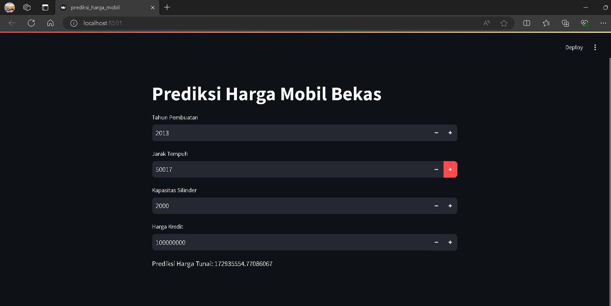

# Prediksi Harga Mobil Bekas

Proyek ini bertujuan untuk memprediksi harga mobil bekas menggunakan model regresi linear yang dilatih dengan data historis. Proyek ini mencakup dua bagian utama: melatih model di Google Colab dan membuat aplikasi prediksi interaktif menggunakan Streamlit.

## Pendahuluan

Proyek ini berfokus pada prediksi harga mobil bekas. Model regresi linear dilatih menggunakan data historis untuk memprediksi harga berdasarkan berbagai fitur seperti tahun pembuatan, jarak tempuh, kapasitas silinder, dan harga kredit.

## Panduan Menjalankan Aplikasi

Ikuti langkah-langkah yang saya buat di Panduan menjalankan aplikasi.txt

## Menggunakan Aplikasi
Aplikasi Streamlit akan terbuka di browser Anda. Anda bisa memasukkan data berikut untuk melihat prediksi harga mobil:
1. Tahun Pembuatan: Tahun mobil diproduksi (misalnya, 2010)
2. Jarak Tempuh: Jarak tempuh mobil dalam kilometer (misalnya, 50000)
3. Kapasitas Silinder: Kapasitas silinder mesin mobil dalam cc (misalnya, 2000)
4. Harga Kredit: Harga kredit mobil dalam mata uang yang relevan (misalnya, 100000000)
5. Aplikasi akan menampilkan prediksi harga tunai mobil berdasarkan input yang Anda berikan.

